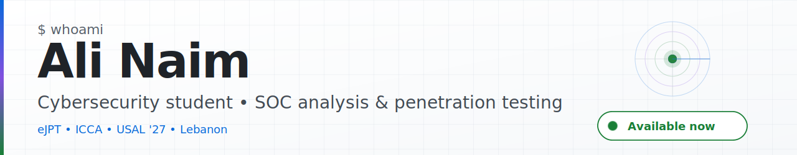

<picture>
  <source media="(max-width: 768px) and (prefers-color-scheme: dark)" srcset="./assets/hero-mobile-dark.svg">
  <source media="(max-width: 768px)" srcset="./assets/hero-mobile-light.svg">
  <source media="(prefers-color-scheme: dark)" srcset="./assets/hero-dark.svg">
  
</picture>

 
 

&nbsp;

---

## About

 Cybersecurity student at **USAL** in Lebanon, graduating **2027**. I learn by building — small, end-to-end home labs that cover both sides of the same problem: how an attack actually works, and how a SOC actually sees it.

- **Active Directory pentest lab** — full attack chain on Windows Server 2025, from enumeration to Golden Ticket persistence
- **SentinelForge honeypot** — Raspberry Pi SSH honeypot wired into a Wazuh SIEM with custom detection rules and Discord alerting
- **SOC SOAR pipeline** — Wazuh + Sysmon + n8n detecting brute-force attacks across Linux and Windows in under eight seconds

I'm **available now** for SOC analyst and penetration testing internships or junior roles — remote, hybrid, or Beirut-based.

---

## What I'm doing right now

|  |  |
|:---|:---|
| 🟢 &nbsp; **Building** &nbsp; | **SentinelForge** — extending the Wazuh ruleset and enriching alerts with HASSH fingerprinting for brute-force attribution |
| 🔵 &nbsp; **Reading** &nbsp; | **Wazuh** rules-and-decoders reference · **MITRE ATT&CK** Enterprise matrix · PortSwigger Web Security Academy notes |
| 🟠 &nbsp; **Studying** &nbsp; | Windows internals and PowerShell for AD red-teaming · Kerberos delegation attacks · detection-rule design patterns |

---

## Featured projects

<table>

<tr>
<td width="50%" valign="top">

### 🛡️ &nbsp; [active-directory-pentest-lab](https://github.com/naim-ali27/active-directory-pentest-lab)

Full AD attack chain on Windows Server 2025: AS-REP Roasting, DCSync, Pass-the-Hash, wmiexec, Golden Ticket. Sanitized commands, eight screenshots, MITRE ATT&CK mapping, remediation notes.

`Impacket` `CrackMapExec` `Hashcat` `Kali` `Windows Server 2025`

**Status** — complete · 7 attack phases documented

</td>
<td width="50%" valign="top">

### 🍯 &nbsp; [SentinelForge](https://github.com/naim-ali27/SentinelForge)

Raspberry Pi SSH honeypot feeding a Wazuh SIEM. Cowrie + Suricata on the Pi, custom Wazuh rules (`100900–100910`), GeoIP enrichment, Discord SOC alerts through n8n.

`Wazuh` `Suricata` `Cowrie` `n8n` `Raspberry Pi`

**Status** — lab-complete · 17 screenshots · 7 custom rules

</td>
</tr>

<tr>
<td width="50%" valign="top">

### 🚨 &nbsp; [soc-soar-detection-pipeline](https://github.com/naim-ali27/soc-soar-detection-pipeline)

End-to-end SOC alerting. Wazuh correlation rules on Sysmon telemetry detect Hydra/CrackMapExec brute force, n8n formats the alert, Discord receives it in under eight seconds.

`Wazuh` `Sysmon` `n8n` `Bash` `Kali`

**Status** — verified end-to-end · alert latency < 8 s

</td>
<td width="50%" valign="top">

### 📚 &nbsp; [ejpt-ctf-writeups](https://github.com/naim-ali27/ejpt-ctf-writeups)

Nine writeups from the INE eJPT path. Exploitation, post-exploitation, pivoting, privilege escalation. EternalBlue, Mimikatz, sudo abuse, SUID hunts, multi-host chains.

`Metasploit` `Nmap` `Meterpreter` `Mimikatz` `proxychains`

**Status** — 9 labs · eJPT passed Feb 2026

</td>
</tr>

<tr>
<td width="50%" valign="top">

### 🌐 &nbsp; [packet-tracer-enterprise-network](https://github.com/naim-ali27/packet-tracer-enterprise-network)

Multi-region Cisco network: VLAN segmentation, OSPF + RIP with mutual redistribution, DHCP/DNS/HTTP/Syslog services, ACL-based Internet filtering. 

`Cisco` `Packet Tracer` `OSPF` `RIP` `VLAN` `ACL`

**Status** — deployed ·

</td>
<td width="50%" valign="top">

### 🧪 &nbsp; [TryHackMe-CTF-Writeups](https://github.com/naim-ali27/TryHackMe-CTF-Writeups)

Markdown writeups for four TryHackMe rooms — Anonymous, Broker, LazyAdmin, Wonderland. SUID abuse, Apache ActiveMQ RCE, sudo chains, CVE-2021-4034 PwnKit.

`Nmap` `gobuster` `Metasploit` `PwnKit`

**Status** — 4 rooms · flags redacted

</td>
</tr>

</table>

---

## Stack

---

## Certifications

| | |
|:---|:---|
| 🎓 &nbsp; **eJPT — eLearnSecurity Junior Penetration Tester** &nbsp; *(Feb 2026)* | INE Security · hands-on practical exam. Network and web enumeration, exploitation, post-exploitation, pivoting, and privilege escalation across Linux and Windows targets. |
| ☁️ &nbsp; **ICCA — INE Certified Cloud Associate** &nbsp; *(Nov 2025)* | INE Security · cloud fundamentals across AWS, Azure, and GCP — identity, networking, storage, and the shared-responsibility model. |

---

## GitHub stats

&nbsp;

---

## Let's work together

Open to **SOC analyst · penetration testing · cybersecurity internship** roles &nbsp;·&nbsp; **available now**

&nbsp;

Lebanon &nbsp;·&nbsp; Arabic, English, French

